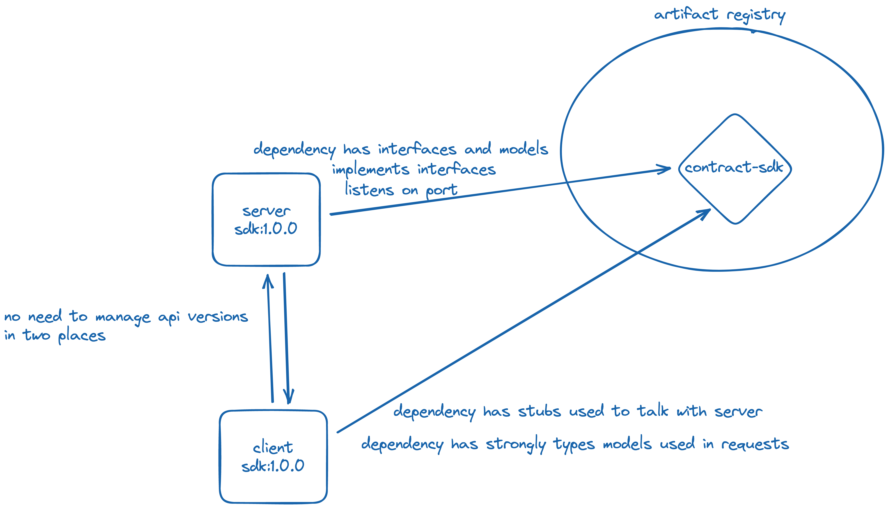

# This is a sandbox to demonstrate using gRPC for service-to-service comms



# How to run this demo

1. inside `server/` directory run `sbt run`. you will see a gRPC server start listening on 50052
2. inside `client/` directory run `sbt run`. you will see a REST server start listening on 9007
3. use your favorite client to send a get requests to the following endpoints

- `localhost:9097/start-streamint/PAYLOAD_GOES_HERE` this will start a streaming request between the client and the grpc
- `localhost:9097/single-request/PAYLOAD_GOES_HERE` this will proxy a single request to the grpc server and return the response
- `localhost:9097/benchmark` this will start a benchmark that will determine the overhead in `ms` for generating a new client for every request that is sent

4. [postman supports grpc](https://blog.postman.com/postman-now-supports-grpc/), and the server is setup to support reflection, give it a shot. you'll connect to `localhost:50052`

# About this Demo

## contract-sdk

The [contract-sdk](./contract-sdk) project defines protobuf files, and will build and publish a maven jar to google's artifact registry.

- The client uses this contract to build sending/receiving logic around strong types and well defined interfaces
- The server implements a given version of the contract, so as long as the client and server are using the same SDK version we know they will be able to communicate

# Some Tools To Help You

- https://doc.akka.io/docs/akka-grpc/current/index.html

# How to audit the version of the published contract sdk

I'm going to store the sdk in the GAR
I followed this tutorial to learn
https://cloud.google.com/artifact-registry/docs/java/store-java

If you want to run this I'll need to add you as a viewer in my personal GCP project. just ask tyler@dv01.co

```sh
export REPO_NAME=java-repo
export LOCATION=us-central1
gcloud config set artifacts/repository $REPO_NAME
gcloud config set artifacts/location $LOCATION
gcloud artifacts packages list --repository=$REPO_NAME
gcloud artifacts versions list --package=gRPC-rfc:contract-sdk
```
